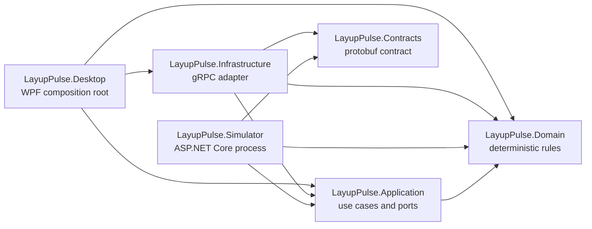
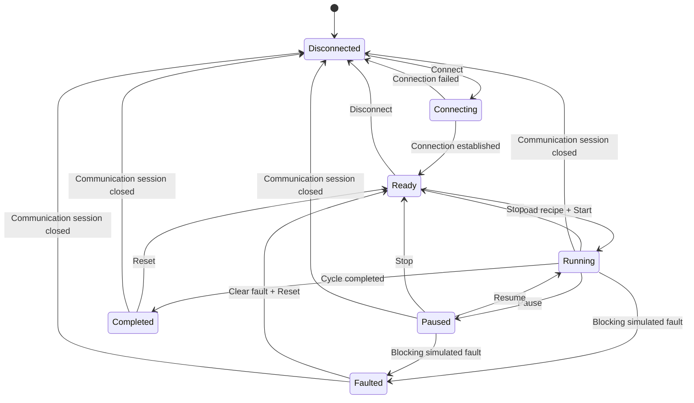

# LayupPulse

LayupPulse is an independent WPF industrial software demonstrator for supervising a simulated automated composite layup cell.

It showcases real-time gRPC communication, deterministic machine-state management, asynchronous telemetry processing, alarm lifecycle management, bounded real-time charts, and 3D visualization.

[](https://github.com/arnaud-wissart-lab/layup-pulse/actions/workflows/ci.yml)


[](LICENSE)


> [!IMPORTANT]
> The current application implements the simulator, gRPC session, bounded telemetry, alarms, charts, and 3D overview. SQLite production history and the History page are not implemented. The corresponding demo step is documented as a target and must not be presented as complete on the current revision.

## Demo

The fastest developer workflow is:

```powershell
./scripts/run-demo.ps1
```

The script checks the pinned .NET 10 SDK, builds only when outputs are missing or stale, starts the simulator, waits for its local gRPC socket, starts the WPF application, and stops the simulator when the application closes.

### Two-minute demo scenario

1. Launch LayupPulse and select **Connect**.
2. Load **Wing Panel Demo** and select **Start**.
3. Observe live telemetry, bounded charts, progress, and the moving 3D visualization.
4. In **Diagnostics**, inject **Over temperature**.
5. Observe the `Faulted` state and the high-temperature alarm.
6. In **Alarms**, acknowledge the alarm; acknowledgment does not clear its condition.
7. Return to **Diagnostics**, clear the fault, then select **Reset**.
8. Open **History** and show the persisted run once the SQLite integration is complete. On the current revision, identify this page honestly as a known limitation.
9. Demonstrate communication loss and recovery only after rehearsing it on the target machine.

The timed presenter notes and recovery guidance are in [docs/demo-scenario.md](docs/demo-scenario.md).

## Purpose

LayupPulse is a portfolio demonstrator for software architecture and operator-interface engineering around a fictional composite layup cell. It is designed to make process separation, deterministic behavior, cancellation, bounded high-frequency data handling, diagnostics, and testability visible in a compact Windows application.

It is not a machine controller, safety system, manufacturing execution system, or representation of a real industrial product.

## Features

- Separate deterministic simulator and WPF desktop processes.
- Versioned protobuf contract and server-streaming gRPC telemetry.
- Explicit machine commands with correlated acceptance or rejection results.
- Bounded telemetry acquisition, rolling history, one-second aggregation, and UI coalescing.
- Automatic serialized reconnection with bounded exponential backoff.
- Five deterministic simulated fault profiles and alarm rules.
- Alarm raise, acknowledge, clear, and bounded in-memory history lifecycle.
- ScottPlot trends capped by time window, refresh rate, and point count.
- HelixToolkit/WPF 3D visualization driven by coalesced telemetry.
- Focused unit, architecture, transport, cancellation, and integration tests.
- Reproducible Windows x64 self-contained packaging and smoke testing.

## Architecture

LayupPulse uses dependency inversion to keep domain and application behavior independent from WPF, gRPC, ASP.NET Core, EF Core, and SQLite.



Arrows mean “depends on.” Desktop and Simulator are the only composition roots. ViewModels consume application-facing abstractions and never access a `DbContext` directly. See [docs/architecture.md](docs/architecture.md) for the complete boundaries and data-rate design.

## Technology stack

| Area | Technology |
| --- | --- |
| Runtime and language | .NET 10, C# 14 |
| Desktop | WPF on `net10.0-windows` |
| Inter-process transport | ASP.NET Core gRPC, Grpc.Net.Client, Protocol Buffers |
| Presentation patterns | CommunityToolkit.Mvvm, Generic Host |
| Charts | ScottPlot.WPF 5 |
| 3D visualization | HelixToolkit.Wpf on WPF 3D |
| Persistence target | EF Core 10 and SQLite; concrete adapter not yet implemented |
| Tests | xUnit and Microsoft.NET.Test.Sdk |
| Automation | PowerShell and GitHub Actions on Windows |

Direct dependency license information is recorded in [THIRD-PARTY-NOTICES.md](THIRD-PARTY-NOTICES.md).

## Machine state model

Commands are valid only in explicit states. Rejected commands return a structured reason and do not silently mutate state.



The top-level states are `Disconnected`, `Connecting`, `Ready`, `Running`, `Paused`, `Faulted`, and `Completed`.

## Telemetry pipeline

The simulator publishes 20 samples per second by default and supports 1–50 Hz. One shared deterministic tick feeds a bounded channel of capacity eight per subscriber using `DropOldest`. The client reads sequentially, evaluates every acquired sample for alarms, retains at most 60 seconds or 3,000 samples, creates at most 60 one-second aggregates, and publishes immutable UI snapshots at up to 10 Hz. Charts redraw at up to 5 Hz and render no more than 600 points per signal.

Sequence numbers make dropped samples observable. Acquisition, aggregation, and rendering rates remain independent, and raw telemetry is never appended directly to an unbounded WPF collection.

## Alarm lifecycle

An alarm moves from `Raised` to `Acknowledged` when the operator confirms awareness, and to `Cleared` only when the simulated condition disappears. A condition may also clear before acknowledgment. Acknowledgment never removes or repairs the underlying condition.

The initial catalog covers high temperature, low material pressure, unstable compaction force, communication timeout, and head-position error. Active alarms are unique by code and source; cleared occurrences remain in a bounded in-memory history.

## Data persistence

The intended persistence boundary would use EF Core and local SQLite behind application ports for production runs, alarm occurrences, and downsampled telemetry aggregates. Domain entities must remain independent from EF Core, and future history queries must be asynchronous and bounded.

On the current revision, the persistence contracts, concrete SQLite store, migrations, recording service, composition, and History ViewModel do not exist. No README or demo should claim that run history survives restart until those pieces and their integration tests are present.

## Getting started

Requirements:

- Windows 10 or Windows 11, x64, for the WPF application.
- The .NET 10 SDK resolved by [`global.json`](global.json).
- Local TCP port `5057`, or another loopback endpoint configured for both processes.

Clone and validate:

```powershell
git clone https://github.com/arnaud-wissart-lab/layup-pulse.git
cd layup-pulse
dotnet restore LayupPulse.sln
dotnet build LayupPulse.sln -c Release --no-restore
dotnet test LayupPulse.sln -c Release --no-build
```

The default transport is clear-text HTTP/2 on `http://127.0.0.1:5057`, bound to loopback for local demonstration only.

## Run with one command

Run from the repository root:

```powershell
./scripts/run-demo.ps1
```

Force a fresh Release build:

```powershell
./scripts/run-demo.ps1 -Build
```

Use an alternate local endpoint and deterministic simulator settings:

```powershell
./scripts/run-demo.ps1 `
  -Endpoint "http://127.0.0.1:5058" `
  -Seed 1729 `
  -TelemetryRateHz 25
```

Exercise startup non-interactively:

```powershell
./scripts/run-demo.ps1 -SmokeTest -SmokeTestDurationSeconds 5
```

## Run manually

Start the simulator from the repository root:

```powershell
dotnet run --project src/LayupPulse.Simulator/LayupPulse.Simulator.csproj -- `
  --Simulator:Endpoint=http://127.0.0.1:5057
```

In a second PowerShell terminal, start the desktop application:

```powershell
dotnet run --project src/LayupPulse.Desktop/LayupPulse.Desktop.csproj -- `
  --Machine:Endpoint=http://127.0.0.1:5057
```

The dedicated simulator helper remains available for custom seeds and rates:

```powershell
./scripts/run-simulator.ps1 -Seed 1729 -TelemetryRateHz 25
```

## Tests

Run the same local validation sequence used by CI:

```powershell
dotnet restore LayupPulse.sln
dotnet format LayupPulse.sln --verify-no-changes --no-restore
dotnet build LayupPulse.sln -c Release --no-restore
dotnet test LayupPulse.sln -c Release --no-build
git diff --check
```

The suite covers domain transitions, recipe validation, deterministic simulation, fault behavior, alarm rules, bounded telemetry, reconnect serialization, gRPC mapping and process integration, cancellation, ViewModel command feedback, and project dependency directions.

## Packaging

Create and smoke-test a Windows x64 self-contained package:

```powershell
./scripts/package-demo.ps1
```

Outputs:

```text
artifacts/
├── LayupPulse-win-x64/
│   ├── Desktop/
│   ├── Simulator/
│   ├── Run-LayupPulse.cmd
│   ├── Run-LayupPulse.ps1
│   ├── README.txt
│   ├── LICENSE.txt
│   └── THIRD-PARTY-NOTICES.txt
└── LayupPulse-win-x64.zip
```

The package is self-contained, preserves native dependencies, does not use single-file publishing, excludes development settings and debug symbols, and runs a startup smoke test before creating the ZIP. `artifacts/` is ignored by Git.

## Repository structure

| Path | Responsibility |
| --- | --- |
| `src/LayupPulse.Domain` | Technology-independent state, recipe, alarm, telemetry, and run rules |
| `src/LayupPulse.Application` | Use cases, ports, session supervision, and bounded telemetry pipeline |
| `src/LayupPulse.Contracts` | Versioned protobuf and generated gRPC types |
| `src/LayupPulse.Infrastructure` | Concrete gRPC adapter and boundary reserved for future persistence integration |
| `src/LayupPulse.Simulator` | Separate deterministic simulator and gRPC server |
| `src/LayupPulse.Desktop` | WPF views, ViewModels, controls, and composition root |
| `tests/LayupPulse.Tests` | Unit, architecture, and integration tests |
| `docs` | Product, architecture, UI, demo, and decision records |
| `scripts` | Repeatable development, demo, and packaging automation |
| `.github/workflows` | Windows continuous integration |

## Architecture decisions

Material decisions are recorded under [docs/decisions](docs/decisions/README.md), including .NET 10, gRPC transport, centralized session ownership, bounded telemetry and reconnect behavior, ScottPlot/WPF 3D visualization, and the planned SQLite aggregation boundary.

## Known limitations

- The SQLite store and durable History page are not wired on the current revision.
- The local gRPC endpoint uses clear-text HTTP/2 and has no authentication or remote-deployment hardening.
- The Windows package is unsigned and may trigger SmartScreen warnings.
- Charts currently restore a transitive WPF compatibility asset that NuGet reports as targeting .NET Framework; runtime smoke testing mitigates but does not remove this dependency risk.
- The 3D scene is deliberately simplified and does not import CAD data or represent real equipment geometry.
- Fault injection is deterministic demonstration behavior, not a model of industrial safety or failure physics.
- GitHub Actions is green on the current public `main` commit; each future release candidate still requires its own successful run.

## Roadmap

- Complete the concrete EF Core/SQLite adapter, migrations, recording orchestration, History ViewModel, and integration tests.
- Add signed release provenance and a repeatable release workflow after the package format stabilizes.
- Capture a short, versioned demonstration GIF after the final persistence workflow is available.
- Continue measuring UI rendering and dependency compatibility before upgrading chart or 3D libraries.

The broader delivery sequence is tracked in [docs/implementation-plan.md](docs/implementation-plan.md).

## Disclaimer

This project is an independent technical demonstrator. It is not affiliated with, endorsed by, or based on proprietary software, machine designs, or production data from any industrial equipment manufacturer. It must not be used to control real machinery or implement safety functions.

## License

LayupPulse is available under the [MIT License](LICENSE). Third-party components remain subject to their respective licenses as listed in [THIRD-PARTY-NOTICES.md](THIRD-PARTY-NOTICES.md).
