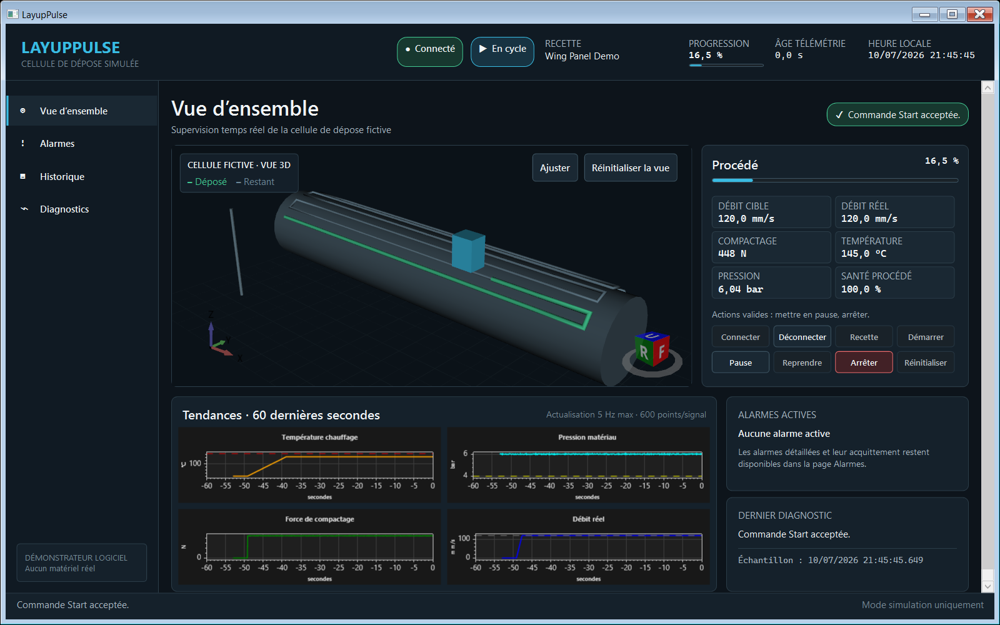

# LayupPulse

LayupPulse est un démonstrateur logiciel industriel WPF indépendant destiné à la supervision d’une cellule automatisée fictive de dépose de matériaux composites.

Il présente une communication gRPC en temps réel, une gestion déterministe de l’état de la machine, un traitement asynchrone de la télémétrie, un cycle de vie complet des alarmes, des graphiques en temps réel bornés et une visualisation 3D.

[](https://github.com/arnaud-wissart-lab/layup-pulse/actions/workflows/ci.yml)


[](LICENSE)



> [!IMPORTANT]
> LayupPulse est un démonstrateur logiciel pour une cellule fictive simulée. Son historique SQLite local sert uniquement à illustrer la traçabilité : il ne s’agit ni d’un MES, ni d’un enregistrement industriel validé, ni d’une fonction de commande ou de sécurité.

## Démonstration

La manière la plus rapide de lancer le projet en développement est la suivante :

```powershell
./scripts/run-demo.ps1
```

Le script vérifie la version du SDK .NET 10 fixée par le dépôt, ne compile que si les sorties sont absentes ou obsolètes, démarre le simulateur, attend l’ouverture de son point d’accès gRPC local, lance l’application WPF, puis arrête le simulateur à la fermeture de l’application.

### Scénario de démonstration en deux minutes

1. Lancez LayupPulse, puis sélectionnez **Connecter**.
2. Chargez la recette **Wing Panel Demo**, puis sélectionnez **Démarrer**.
3. Observez la télémétrie en direct, les graphiques bornés, la progression et la visualisation 3D animée.
4. Dans **Diagnostics**, injectez le défaut **Surchauffe**.
5. Observez l’état `Faulted` et l’alarme de température élevée.
6. Dans **Alarmes**, acquittez l’alarme ; cet acquittement ne fait pas disparaître la condition simulée.
7. Revenez dans **Diagnostics**, levez le défaut, puis sélectionnez **Réinitialiser**.
8. Ouvrez **Historique**, filtrez les cycles persistés, puis examinez les alarmes et les agrégats télémétriques d’une seconde du cycle sélectionné.
9. Ne présentez la perte et le rétablissement de la communication qu’après avoir répété ce scénario sur la machine utilisée pour la démonstration.

Les notes chronométrées et les consignes de reprise sont disponibles dans [le scénario de démonstration](docs/demo-scenario.md).

## Objectif

LayupPulse est un projet de portfolio consacré à l’architecture logicielle et à la conception d’interfaces opérateur autour d’une cellule fictive de dépose de matériaux composites. Cette application Windows compacte rend observables la séparation des processus, le comportement déterministe, l’annulation, le traitement borné des données à haute fréquence, les diagnostics et la testabilité.

Ce projet n’est ni un contrôleur de machine, ni un système de sécurité, ni un système d’exécution de la production, ni la représentation d’un produit industriel réel.

## Fonctionnalités

- Processus séparés pour le simulateur déterministe et l’application de bureau WPF.
- Contrat protobuf versionné et télémétrie gRPC diffusée par flux serveur.
- Commandes machine explicites avec résultats d’acceptation ou de rejet corrélés.
- Acquisition télémétrique, historique roulant, agrégation à la seconde et publication UI entièrement bornés.
- Reconnexion automatique sérialisée avec délai exponentiel borné.
- Cinq profils déterministes de défauts simulés et leurs règles d’alarme.
- Cycle de vie des alarmes couvrant le déclenchement, l’acquittement et la fin de condition, avec historique en mémoire borné.
- Historique SQLite local et durable pour les résumés de cycles, les alarmes et les agrégats UTC d’une seconde.
- Vue **Historique** asynchrone et bornée, avec filtre sur l’état final et détails du cycle sélectionné.
- Fondation de rapport de cycle imprimable et exportable en XPS, encapsulée
  dans Desktop et non encore raccordée à la vue **Historique**.
- Tendances ScottPlot limitées par fenêtre temporelle, fréquence de rafraîchissement et nombre de points.
- Visualisation 3D HelixToolkit/WPF alimentée par la télémétrie regroupée.
- Tests unitaires, d’architecture, de transport, d’annulation et d’intégration ciblés.
- Création reproductible d’un paquet Windows x64 autonome, accompagnée d’un test de démarrage.

## Architecture

LayupPulse applique l’inversion de dépendances afin que le domaine et les cas d’usage restent indépendants de WPF, gRPC, ASP.NET Core, EF Core et SQLite.

La colonne **Dépendances** indique les projets de la solution dont dépend directement chaque projet :

| Projet | Responsabilité principale | Dépendances |
| --- | --- | --- |
| `LayupPulse.Desktop` | Interface WPF et racine de composition de l’application de bureau | `Application`, `Domain`, `Infrastructure` |
| `LayupPulse.Simulator` | Processus ASP.NET Core et simulation déterministe | `Application`, `Domain`, `Contracts` |
| `LayupPulse.Infrastructure` | Adaptateurs gRPC et EF Core/SQLite | `Application`, `Domain`, `Contracts` |
| `LayupPulse.Application` | Cas d’usage et ports indépendants des technologies | `Domain` |
| `LayupPulse.Contracts` | Contrat protobuf versionné | Aucune |
| `LayupPulse.Domain` | Règles métier déterministes | Aucune |

`Desktop` et `Simulator` sont les deux seules racines de composition. Les ViewModels consomment des abstractions exposées par la couche Application et n’accèdent jamais directement à un `DbContext`. Consultez [la documentation d’architecture](docs/architecture.md) pour connaître l’ensemble des frontières et la séparation des cadences de traitement.

## Socle technologique

| Domaine | Technologie |
| --- | --- |
| Environnement d’exécution et langage | .NET 10, C# 14 |
| Application de bureau | WPF sur `net10.0-windows` |
| Transport interprocessus | ASP.NET Core gRPC, Grpc.Net.Client, Protocol Buffers |
| Présentation | CommunityToolkit.Mvvm, Generic Host |
| Documents | CODE.Framework.Wpf.Documents 6.0.0, impression WPF et XPS |
| Graphiques | ScottPlot.WPF 5 |
| Visualisation 3D | HelixToolkit.Wpf sur WPF 3D |
| Persistance | EF Core 10, SQLite et migrations |
| Tests | xUnit et Microsoft.NET.Test.Sdk |
| Automatisation | PowerShell et GitHub Actions sous Windows |

Les licences des dépendances directes sont recensées dans [THIRD-PARTY-NOTICES.md](THIRD-PARTY-NOTICES.md).

## Modèle d’état de la machine

Les commandes ne sont valides que dans des états explicites. Une commande rejetée renvoie une raison structurée et ne modifie jamais l’état silencieusement.

| État de départ | État d’arrivée | Événement ou commande |
| --- | --- | --- |
| Initialisation | `Disconnected` | Démarrage du simulateur |
| `Disconnected` | `Connecting` | `Connect` |
| `Connecting` | `Ready` | Connexion établie |
| `Connecting` | `Disconnected` | Échec de la connexion |
| `Ready` | `Running` | Recette chargée, puis `Start` |
| `Running` | `Paused` | `Pause` |
| `Paused` | `Running` | `Resume` |
| `Running` ou `Paused` | `Ready` | `Stop` |
| `Running` | `Completed` | Cycle terminé |
| `Running` ou `Paused` | `Faulted` | Défaut simulé bloquant |
| `Faulted` | `Ready` | Levée du défaut, puis `Reset` |
| `Completed` | `Ready` | `Reset` |
| `Ready` | `Disconnected` | `Disconnect` |
| `Running`, `Paused`, `Faulted` ou `Completed` | `Disconnected` | Fermeture de la session de communication |

Les sept états de premier niveau sont `Disconnected`, `Connecting`, `Ready`, `Running`, `Paused`, `Faulted` et `Completed`.

## Pipeline de télémétrie

Le simulateur publie 20 échantillons par seconde par défaut et prend en charge une fréquence comprise entre 1 et 50 Hz. Un tick déterministe partagé alimente, pour chaque abonné, un canal borné de capacité 8 appliquant la politique `DropOldest`. Le client lit les valeurs séquentiellement, évalue chaque échantillon acquis au regard des règles d’alarme, conserve au plus 60 secondes ou 3 000 échantillons, produit au maximum 60 agrégats d’une seconde et publie des instantanés UI immuables à une fréquence maximale de 10 Hz. Les graphiques sont redessinés au plus à 5 Hz et n’affichent pas plus de 600 points par signal.

Les numéros de séquence rendent les échantillons perdus observables. Les fréquences d’acquisition, d’agrégation et de rendu restent indépendantes, et la télémétrie brute n’est jamais ajoutée directement à une collection WPF non bornée.

## Cycle de vie des alarmes

Une alarme passe de `Raised` à `Acknowledged` lorsque l’opérateur confirme en avoir pris connaissance, puis à `Cleared` uniquement lorsque la condition simulée disparaît. Une condition peut également disparaître avant son acquittement. L’acquittement ne supprime ni ne corrige jamais la condition sous-jacente.

Le catalogue initial couvre la température élevée, la pression matière insuffisante, l’instabilité de la force de compactage, le délai de communication dépassé et l’erreur de position de la tête. Les alarmes actives sont uniques par code et par source ; les occurrences terminées restent dans un historique en mémoire borné.

## Persistance des données

EF Core et SQLite restent confinés dans Infrastructure, derrière des ports exposés par la couche Application. La base est créée au moyen de la migration initiale dans `%LOCALAPPDATA%\LayupPulse\layuppulse.db`. Le service d’écriture consomme une file bornée à l’aide de contextes à durée de vie courte. Les requêtes de la vue **Historique** sont asynchrones, en lecture seule et limitées par un nombre maximal explicite de résultats. Une défaillance de la base est journalisée et présentée comme un diagnostic non fatal ; l’acquisition télémétrique se poursuit.

Seuls les résumés de cycles de production, le cycle de vie des alarmes et les agrégats télémétriques UTC d’une seconde sont persistés. Les échantillons bruts à 20 Hz ne sont jamais enregistrés. La page **Historique** présente d’abord les cycles les plus récents, applique un filtre sur leur état final et charge un volume borné d’alarmes et d’agrégats pour le cycle sélectionné. SQLite assure la continuité locale du démonstrateur entre les redémarrages de l’application ; il ne fournit aucune garantie de traçabilité industrielle.

## Prise en main

Prérequis :

- Windows 10 ou Windows 11 x64 pour l’application WPF.
- Le SDK .NET 10 sélectionné par [`global.json`](global.json).
- Le port TCP local `5057`, ou un autre point d’accès sur l’interface de bouclage configuré pour les deux processus.

Clonez le dépôt, puis validez la solution :

```powershell
git clone https://github.com/arnaud-wissart-lab/layup-pulse.git
cd layup-pulse
dotnet restore LayupPulse.sln
dotnet build LayupPulse.sln -c Release --no-restore
dotnet test LayupPulse.sln -c Release --no-build
```

Le transport par défaut utilise HTTP/2 sans chiffrement à l’adresse `http://127.0.0.1:5057`, limitée à l’interface de bouclage et destinée uniquement à une démonstration locale.

## Exécution en une commande

Depuis la racine du dépôt, exécutez :

```powershell
./scripts/run-demo.ps1
```

Pour forcer une nouvelle compilation Release :

```powershell
./scripts/run-demo.ps1 -Build
```

Pour utiliser un autre point d’accès local et des paramètres déterministes personnalisés :

```powershell
./scripts/run-demo.ps1 `
  -Endpoint "http://127.0.0.1:5058" `
  -Seed 1729 `
  -TelemetryRateHz 25
```

Pour vérifier le démarrage sans interaction :

```powershell
./scripts/run-demo.ps1 -SmokeTest -SmokeTestDurationSeconds 5
```

## Exécution manuelle

Depuis la racine du dépôt, démarrez le simulateur :

```powershell
dotnet run --project src/LayupPulse.Simulator/LayupPulse.Simulator.csproj -- `
  --Simulator:Endpoint=http://127.0.0.1:5057
```

Dans un second terminal PowerShell, démarrez l’application de bureau :

```powershell
dotnet run --project src/LayupPulse.Desktop/LayupPulse.Desktop.csproj -- `
  --Machine:Endpoint=http://127.0.0.1:5057
```

Le script dédié au simulateur reste disponible pour personnaliser la graine et la fréquence :

```powershell
./scripts/run-simulator.ps1 -Seed 1729 -TelemetryRateHz 25
```

## Tests

Exécutez la même séquence de validation locale que la CI :

```powershell
dotnet restore LayupPulse.sln
dotnet format LayupPulse.sln --verify-no-changes --no-restore
dotnet build LayupPulse.sln -c Release --no-restore
dotnet test LayupPulse.sln -c Release --no-build
git diff --check
```

La suite couvre les transitions du domaine, la validation des recettes, la simulation déterministe, le comportement des défauts, les règles d’alarme, la télémétrie bornée, la sérialisation des reconnexions, les mappings gRPC et l’intégration des processus, l’annulation, le retour des commandes dans les ViewModels, le sens des dépendances entre projets, les migrations SQLite réelles, la persistance après réouverture de la base avec un nouveau contexte ainsi que la projection, le bornage et la sérialisation XPS du rapport de cycle.

## Création du paquet

Pour créer et tester au démarrage un paquet Windows x64 autonome :

```powershell
./scripts/package-demo.ps1
```

Fichiers produits :

```text
artifacts/
├── LayupPulse-win-x64/
│   ├── Desktop/
│   ├── Simulator/
│   ├── Run-LayupPulse.cmd
│   ├── Run-LayupPulse.ps1
│   ├── README.txt
│   ├── LICENSE.txt
│   └── THIRD-PARTY-NOTICES.txt
└── LayupPulse-win-x64.zip
```

Le paquet est autonome, conserve les dépendances natives, n’utilise pas la publication en fichier unique, exclut les paramètres de développement et les symboles de débogage, puis exécute un test de démarrage avant la création de l’archive ZIP. Le dossier `artifacts/` est ignoré par Git.

## Structure du dépôt

| Chemin | Responsabilité |
| --- | --- |
| `src/LayupPulse.Domain` | États, recettes, alarmes, télémétrie et règles de cycle indépendants des technologies |
| `src/LayupPulse.Application` | Cas d’usage, ports, supervision de session et pipeline télémétrique borné |
| `src/LayupPulse.Contracts` | Contrat protobuf versionné et types gRPC générés |
| `src/LayupPulse.Infrastructure` | Adaptateurs gRPC et EF Core/SQLite, enregistrements, requêtes et migrations |
| `src/LayupPulse.Simulator` | Simulateur déterministe séparé et serveur gRPC |
| `src/LayupPulse.Desktop` | Vues WPF, ViewModels, contrôles et racine de composition |
| `tests/LayupPulse.Tests` | Tests unitaires, d’architecture et d’intégration |
| `docs` | Documentation produit, architecture, interface, démonstration et décisions |
| `scripts` | Automatisation reproductible du développement, de la démonstration et de la création du paquet |
| `.github/workflows` | Intégration continue sous Windows |

## Décisions d’architecture

Les décisions structurantes sont consignées dans [les comptes rendus de décisions d’architecture](docs/decisions/README.md). Elles couvrent notamment .NET 10, le transport gRPC, la centralisation du cycle de vie de la session, la télémétrie bornée et la reconnexion, le rendu ScottPlot/WPF 3D, la frontière d’agrégation SQLite ainsi que l’adoption sélective de CODE Framework Documents.

## Limites connues

- L’historique se limite volontairement aux cycles locaux récents et aux détails du cycle sélectionné. Le socle de rapport prend en charge l’impression WPF et l’export XPS, mais aucune commande n’est encore exposée dans l’interface et aucun export PDF natif n’est promis.
- Le point d’accès gRPC local utilise HTTP/2 sans chiffrement et ne dispose ni d’authentification ni de durcissement pour un déploiement distant.
- Le paquet Windows n’est pas signé et peut déclencher un avertissement SmartScreen.
- Les graphiques restaurent actuellement une ressource WPF transitive que NuGet signale comme ciblant .NET Framework ; les tests de démarrage réduisent le risque sans supprimer cette dépendance.
- La scène 3D est volontairement simplifiée : elle n’importe aucune donnée CAO et ne représente pas la géométrie d’un équipement réel.
- L’injection déterministe de défauts sert uniquement à la démonstration ; elle ne modélise ni la sécurité industrielle ni la physique des défaillances.
- Chaque version candidate doit faire l’objet de sa propre exécution réussie de la CI.

## Feuille de route

- Ajouter une provenance signée des versions et un processus de publication reproductible lorsque le format du paquet sera stabilisé.
- Produire un court GIF de démonstration versionné après stabilisation du parcours complet de persistance.
- Continuer à mesurer le rendu de l’interface et la compatibilité des dépendances avant toute mise à niveau des bibliothèques de graphiques ou de 3D.

La séquence de livraison complète est suivie dans [le plan d’implémentation](docs/implementation-plan.md).

## Avertissement

Ce projet est un démonstrateur technique indépendant. Il n’est ni affilié à un fabricant d’équipements industriels, ni approuvé par un tel fabricant, ni fondé sur ses logiciels propriétaires, ses conceptions de machines ou ses données de production. Il ne doit jamais être utilisé pour commander une machine réelle ou mettre en œuvre des fonctions de sécurité.

## Licence

LayupPulse est distribué sous [licence MIT](LICENSE). Les composants tiers restent soumis à leurs licences respectives, recensées dans [THIRD-PARTY-NOTICES.md](THIRD-PARTY-NOTICES.md).
