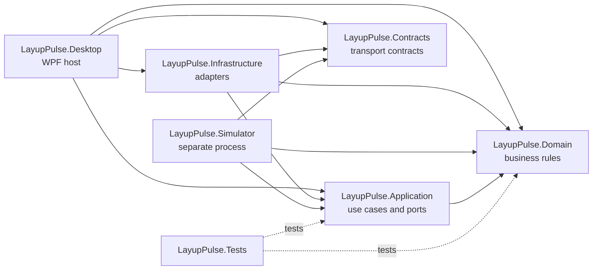
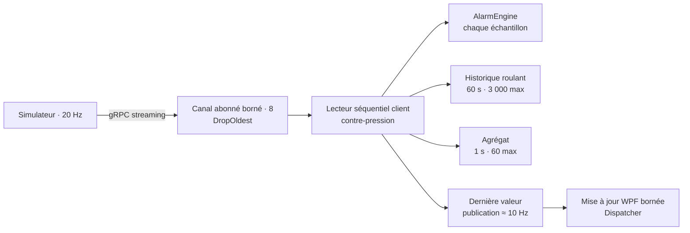
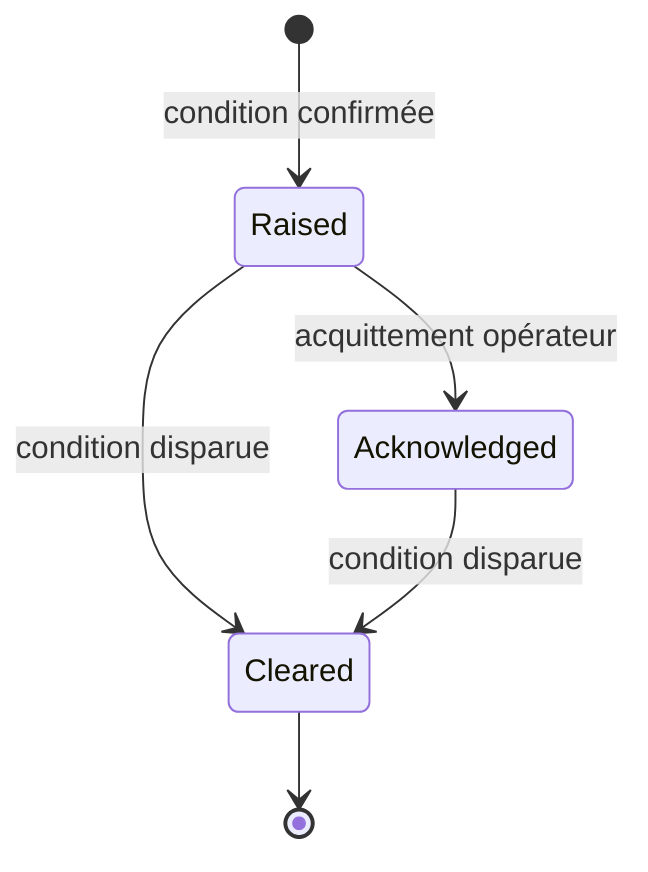
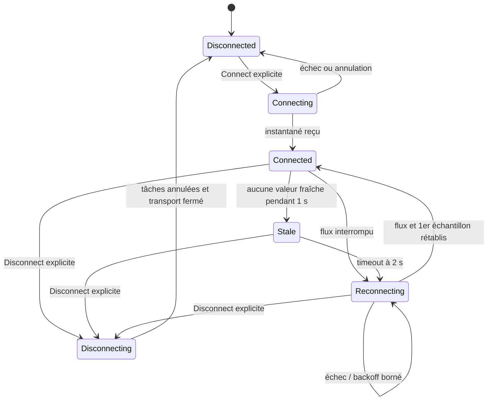
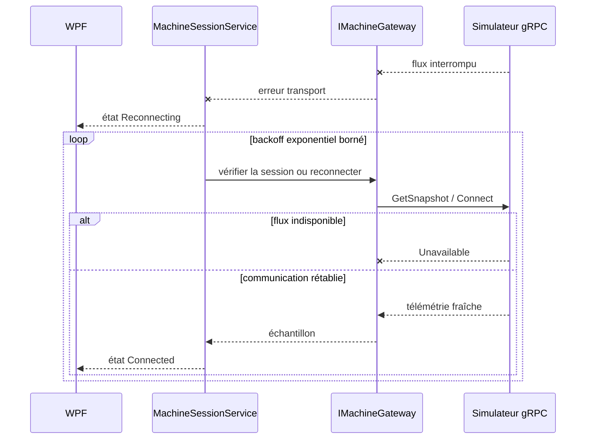

# LayupPulse architecture

## 1. Architectural intent

LayupPulse separates business concepts, use cases, transport contracts, concrete technology adapters, process hosting, and WPF presentation. The dependency direction keeps the deterministic machine model testable without WPF, EF Core, SQLite, ASP.NET Core, or a concrete gRPC client.

L’application de bureau et le simulateur sont des processus distincts. Le simulateur expose un contrat gRPC versionné et le client de bureau l’utilise derrière `IMachineGateway`. Le domaine et l’application demeurent indépendants du transport.

## 2. Project responsibilities

| Project | Responsibility |
| --- | --- |
| `LayupPulse.Domain` | Machine states, valid transitions, command rules, telemetry value objects, alarms, recipes, and production-run rules. It has no solution-project dependency. |
| `LayupPulse.Application` | Use-case orchestration, technology-neutral ports, cancellation boundaries, and application-level results. It may reference Domain only. |
| `LayupPulse.Contracts` | Messages protobuf `layuppulse.v1` et types gRPC générés partagés par le client et le serveur. Le projet ne contient aucune préoccupation WPF ou de persistance. |
| `LayupPulse.Infrastructure` | Concrete gRPC gateway and future persistence adapters. It implements Application ports and maps Contracts to Domain. |
| `LayupPulse.Simulator` | Processus ASP.NET Core séparé, moteur déterministe, mappings explicites et serveur gRPC. Il ne contient ni interface de bureau ni persistance. |
| `LayupPulse.Desktop` | WPF views, bounded ViewModels, desktop services, and the application composition root. ViewModels consume application-facing abstractions and never a `DbContext`. |
| `LayupPulse.Tests` | Unit, integration, architecture, cancellation, and deterministic scenario tests. |

## 3. Dependency rules

- Domain references no other solution project.
- Application may reference Domain.
- Contracts is independent of WPF and Infrastructure.
- Infrastructure may reference Domain, Application, and Contracts.
- Simulator may reference Domain, Application, and Contracts.
- Desktop may reference Domain, Application, Infrastructure, and Contracts.
- Tests may reference only the projects under test.
- Domain and Application never reference WPF, EF Core, SQLite, ASP.NET Core, generated gRPC types, or concrete gRPC clients.
- ViewModels never reference `DbContext` directly.

Arrows in the diagram mean “depends on.”



## 4. Transport gRPC et passerelle machine

Le fichier `machine_simulator.proto` définit les opérations `GetSnapshot`, `StreamTelemetry`, `ExecuteCommand`, `InjectFault` et `ClearFault`. Les messages restent orientés transport : ils portent des identifiants, des enums et des valeurs scalaires versionnés, jamais les objets du domaine. Les mappings manuels résident dans Simulator, seule couche serveur qui dépend simultanément du domaine et des contrats générés.

`StreamTelemetry` est un flux serveur. Un service hébergé produit un seul tick partagé à la fréquence configurée puis distribue les échantillons dans des canaux bornés propres aux abonnés. Le nombre de clients ne modifie donc ni la cadence ni la progression. `Disconnect` termine proprement les flux actifs. `CommunicationDrop` les termine avec le statut gRPC `Unavailable` sans arrêter le serveur, afin que `ClearFault` reste joignable et qu’un nouveau flux puisse être créé après rétablissement.

Le point d’écoute de développement par défaut est `http://127.0.0.1:5057`, en HTTP/2 clair limité à l’interface de bouclage. Cette configuration est destinée uniquement au développement local du démonstrateur fictif ; elle ne constitue pas un modèle de déploiement industriel sécurisé.

Le port applicatif `IMachineGateway` représente la session côté bureau sans exposer les types gRPC. `GrpcMachineGateway`, dans Infrastructure, crée un canal par session, traduit les messages protobuf en objets du domaine, applique un délai aux appels unitaires et libère le canal lors de la déconnexion ou de la destruction de l’hôte. Les défauts injectables sont isolés derrière `IDemoFaultGateway` afin de ne pas les confondre avec une capacité machine générale.

Sa forme est :

```csharp
public interface IMachineGateway : IAsyncDisposable
{
    Task<IMachineSession> ConnectAsync(CancellationToken cancellationToken);
    Task DisconnectAsync(IMachineSession session, CancellationToken cancellationToken);
    Task<CommandResult> ExecuteCommandAsync(
        IMachineSession session,
        MachineCommand command,
        CancellationToken cancellationToken);
    Task<MachineSnapshot> GetSnapshotAsync(
        IMachineSession session,
        CancellationToken cancellationToken);
    IAsyncEnumerable<TelemetrySample> StreamTelemetryAsync(
        IMachineSession session,
        CancellationToken cancellationToken);
}
```

`MachineSessionService` orchestre une seule connexion souhaitée. Il possède l’unique superviseur du flux, le moniteur de fraîcheur, leurs sources d’annulation et le `TelemetryPipeline`. Les échantillons sont traités hors WPF ; seules les captures immuables coalescées à environ 10 Hz sont remarshalées par le shell sur le Dispatcher. Les ViewModels ne construisent et ne résolvent jamais la passerelle.

Le lecteur gRPC client traite séquentiellement les échantillons et exerce donc une contre-pression naturelle : aucune file cliente supplémentaire ne peut croître. Le serveur conserve un canal borné de capacité 8 par abonné avec `DropOldest`. Si le client ne suit plus, la valeur la plus ancienne en attente est remplacée par la plus récente ; le client mesure la perte grâce aux écarts de séquence. Cette politique privilégie explicitement la fraîcheur du démonstrateur.

## 5. Data-rate separation

Acquisition, presentation, and persistence have different responsibilities and must not share one accidental update rate.

| Flow | Initial design target | Behavior |
| --- | --- | --- |
| Simulator and acquisition | 20 échantillons par seconde par défaut, configurables de 1 à 50 | Préserver la séquence et la fraîcheur ; ne réaliser aucun travail UI. |
| Publication UI | Jusqu’à 10 publications par seconde | Présenter le dernier échantillon et déplacer la tête 3D par transformation réutilisée. |
| Rendu des graphiques | Jusqu’à 5 rafraîchissements par seconde | Relire l’historique borné, sous-échantillonner à 600 points par signal puis redessiner uniquement si une nouvelle capture existe. |
| Agrégation future | Une fenêtre par seconde | Produire un résumé borné prêt pour un futur adaptateur de persistance ; aucune écriture EF Core ou SQLite n’existe dans cet incrément. |

Ces cadences sont configurables et restent explicitement séparées. Réduire la cadence UI ne modifie ni l’acquisition, ni l’évaluation des alarmes, ni le déterminisme du simulateur.



## 6. Bounded-memory strategy

- La télémétrie serveur traverse un canal borné avec la politique explicite `DropOldest` ; le client détecte les trous de séquence.
- Le chemin UI privilégie la fraîcheur : les échantillons intermédiaires restent évalués mais une seule dernière valeur est publiée par fenêtre de 100 ms. Le compteur de coalescence est observable.
- L’historique client est limité simultanément à 60 secondes et 3 000 échantillons. À 20 Hz, il contient normalement environ 1 200 valeurs ; la capacité protège également la fréquence maximale de 50 Hz.
- Les agrégats d’une seconde sont limités aux 60 plus récents. Ils ne sont pas persistés dans cette tâche.
- Les alarmes actives sont uniques par code/source et l’historique en mémoire est limité à 500 occurrences.
- Les collections WPF de diagnostics et d’alarmes sont respectivement limitées à 100 et 500 éléments ; aucune `ObservableCollection` ne reçoit la télémétrie brute.
- Diagnostic logs use size and retention limits outside the UI collection model.
- Buffer capacities and dropped/coalesced sample counts are observable diagnostics.

## 7. Graceful cancellation and shutdown

- Every long-running I/O operation accepts and propagates a `CancellationToken`.
- Desktop shutdown, simulator shutdown, machine-session lifetime, and production-run lifetime have explicit cancellation scopes linked only where ownership requires it.
- Producers stop first, complete their bounded channels, and allow consumers to drain critical persistence events within a finite shutdown deadline.
- Le superviseur télémétrique et le moniteur de fraîcheur appartiennent à la connexion souhaitée. Le lecteur de chaque tentative possède un jeton enfant que le timeout peut annuler sans annuler la session entière.
- La boucle de reconnexion est unique, sérialisée et son délai exponentiel est annulable. La déconnexion explicite annule d’abord le propriétaire, attend ses deux tâches, puis ferme le transport dans un délai fini.
- No layer uses `.Result`, `.Wait()`, fire-and-forget tasks without ownership, or an infinite retry loop.
- Disposal is asynchronous where it waits for I/O. Shutdown failures are logged and reported without freezing the UI thread.

## 8. Composition and testability

Desktop and Simulator are the only composition roots. Constructor injection supplies explicit dependencies; no service locator or global mutable container is permitted. Domain state transitions use deterministic inputs. Time, identifiers, storage, transport, and fault profiles are supplied through narrow ports when tests require control.

Unit tests cover business rules and state transitions. Integration tests cover gRPC mapping, SQLite persistence, cancellation, and bounded-buffer behavior. End-to-end smoke tests start both processes only where the Windows CI environment supports them.

### Moteur d’alarmes

`AlarmEngine`, dans Domain, reçoit `TimeProvider` et des seuils configurables. Il n’utilise ni minuterie globale ni heure système directe. Les seuils fictifs initiaux sont :

| Code UI | Règle initiale | Levée de condition |
| --- | --- | --- |
| `TEMP_HIGH` | Température > 165 °C pendant 1 s | Température < 155 °C |
| `PRESSURE_LOW` | Pression < 4 bar pendant 750 ms, règle armée uniquement pendant `Running` | Pression > 5 bar ou sortie du contexte armé |
| `FORCE_UNSTABLE` | Étendue > 100 N sur une fenêtre roulante de 1 s contenant au moins 6 valeurs | Étendue < 50 N |
| `COMM_TIMEOUT` | Aucune télémétrie fraîche pendant 2 s | 3 échantillons frais consécutifs |
| `HEAD_POSITION_ERROR` | Signal explicite `HeadPositionError` du simulateur | Disparition du signal |

L’injection d’un défaut de procédé fait immédiatement passer le simulateur en `Faulted`. Pour `PRESSURE_LOW` et `FORCE_UNSTABLE`, le moteur n’accepte de terminer le debounce après ce passage que si la règle avait été armée par le cycle `Running` immédiatement précédent et que le signal injecté correspondant demeure actif.



L’acquittement ne modifie pas la condition physique simulée. Lors de la levée, l’occurrence quitte la vue active mais conserve ses horodatages de levée, d’acquittement éventuel et de fin dans l’historique borné.

### Surveillance et reconnexion

La télémétrie devient périmée après 1 s. Après 2 s sans valeur fraîche, `COMM_TIMEOUT` est levée, la tentative de flux courante est annulée et l’état visible devient `Reconnecting`. Le superviseur réutilise d’abord la session lorsque les appels unitaires restent joignables, ce qui permet de lever `CommunicationDrop`; sinon il abandonne uniquement la session locale et établit une nouvelle connexion.

Le backoff vaut 250 ms, 500 ms, 1 s puis 2 s au maximum. Ces valeurs sont configurables, bornées à une minute et remises à zéro après réception d’un échantillon. Une seule boucle est créée par connexion explicite, donc aucune tentative ne peut se chevaucher.





## 9. Persistence boundaries

Les futurs types EF Core et le `DbContext` SQLite resteront dans Infrastructure. Application définit déjà les ports de repository et de requête nécessaires à l’intégration en cours. Les entités du domaine ne dépendent d’aucun attribut EF Core. Les ViewModels recevront des modèles de lecture ou services applicatifs et n’interrogeront jamais directement un `DbContext`.

## 10. Décisions technologiques et distribution

Le transport utilise `Grpc.AspNetCore`, `Grpc.Net.Client`, `Grpc.Tools` et `Google.Protobuf`; la justification du choix est consignée dans l’ADR 0001. L’hébergement de la session Desktop est consigné dans l’ADR 0002, la politique de pipeline/reconnexion dans l’ADR 0003, le rendu du tableau de bord dans l’ADR 0004, le socle .NET 10 dans l’ADR 0005 et la cible de persistance agrégée dans l’ADR 0006. Seuls des packages stables sont admis et chaque nouveau choix doit rester proportionné au besoin concret.

La distribution de démonstration publie Desktop et Simulator séparément pour `win-x64`, en mode autonome et sans fichier unique. Cette structure conserve les bibliothèques natives WPF, graphiques, 3D et SQLite dans leurs dossiers de publication. Le package exclut les paramètres de développement, symboles, sources, tests, bases et logs, puis exécute les deux processus depuis le dossier final avant de créer l’archive ZIP.

## 11. Rendu borné du tableau de bord

`OverviewViewModel` obtient une copie du même historique roulant que `TelemetryPipeline` conserve déjà sous les limites simultanées de 60 secondes et 3 000 échantillons. Aucun second tampon non borné n’est créé dans WPF.

`TelemetryChartsControl` utilise ScottPlot.WPF. Un `DispatcherTimer` de 200 ms ne redessine que lorsqu’une nouvelle capture a été publiée. Chaque série est sous-échantillonnée à 600 points au maximum avant rendu. Le minuteur démarre avec `Loaded` et s’arrête avec `Unloaded`, ce qui empêche tout rendu après la fermeture ou lorsque la page n’est plus présentée.

`MachineSceneControl` utilise HelixToolkit.Wpf sur WPF 3D. La géométrie statique du mandrin, du chemin et du repère est créée une seule fois. La tête réutilise un `TranslateTransform3D` dont seules les composantes changent à la cadence UI. Les chemins déposé et restant, limités à 72 points, ne sont découpés qu’au changement d’un palier entier de progression. Helix limite en outre sa boucle de rendu et la scène propose un panneau de repli si son initialisation échoue.

Ces contrôles appartiennent exclusivement à Desktop. Ils ne modifient ni le domaine, ni le contrat gRPC, ni la persistance, ni les règles d’alarme.
