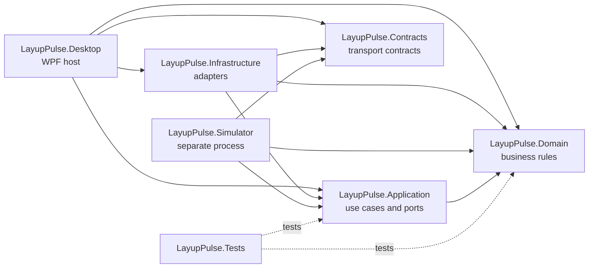

# LayupPulse architecture

## 1. Architectural intent

LayupPulse separates business concepts, use cases, transport contracts, concrete technology adapters, process hosting, and WPF presentation. The dependency direction keeps the deterministic machine model testable without WPF, EF Core, SQLite, ASP.NET Core, or a concrete gRPC client.

L’application de bureau et le simulateur sont des processus distincts. Le simulateur expose désormais un contrat gRPC versionné ; le client de bureau reste différé. Le domaine et l’application demeurent indépendants du transport.

## 2. Project responsibilities

| Project | Responsibility |
| --- | --- |
| `LayupPulse.Domain` | Machine states, valid transitions, command rules, telemetry value objects, alarms, recipes, and production-run rules. It has no solution-project dependency. |
| `LayupPulse.Application` | Use-case orchestration, technology-neutral ports, cancellation boundaries, and application-level results. It may reference Domain only. |
| `LayupPulse.Contracts` | Messages protobuf `layuppulse.v1` et types gRPC générés partagés par le client et le serveur. Le projet ne contient aucune préoccupation WPF ou de persistance. |
| `LayupPulse.Infrastructure` | Concrete gRPC gateway, EF Core and SQLite persistence, clocks, and other adapters. It implements Application ports and maps Contracts to Domain. |
| `LayupPulse.Simulator` | Processus ASP.NET Core séparé, moteur déterministe, mappings explicites et serveur gRPC. Il ne contient ni interface de bureau ni persistance. |
| `LayupPulse.Desktop` | WPF views, bounded ViewModels, desktop services, and the application composition root. ViewModels consume application-facing abstractions and never a `DbContext`. |
| `LayupPulse.Tests` | Unit, integration, architecture, cancellation, and deterministic scenario tests. |

## 3. Dependency rules

- Domain references no other solution project.
- Application may reference Domain.
- Contracts is independent of WPF and Infrastructure.
- Infrastructure may reference Domain, Application, and Contracts.
- Simulator may reference Domain, Application, and Contracts.
- Desktop may reference Domain, Application, Infrastructure, and Contracts.
- Tests may reference only the projects under test.
- Domain and Application never reference WPF, EF Core, SQLite, ASP.NET Core, generated gRPC types, or concrete gRPC clients.
- ViewModels never reference `DbContext` directly.

Arrows in the diagram mean “depends on.”



## 4. Transport gRPC et futur machine gateway

Le fichier `machine_simulator.proto` définit les opérations `GetSnapshot`, `StreamTelemetry`, `ExecuteCommand`, `InjectFault` et `ClearFault`. Les messages restent orientés transport : ils portent des identifiants, des enums et des valeurs scalaires versionnés, jamais les objets du domaine. Les mappings manuels résident dans Simulator, seule couche serveur qui dépend simultanément du domaine et des contrats générés.

`StreamTelemetry` est un flux serveur. Un service hébergé produit un seul tick partagé à la fréquence configurée puis distribue les échantillons dans des canaux bornés propres aux abonnés. Le nombre de clients ne modifie donc ni la cadence ni la progression. `Disconnect` termine proprement les flux actifs. `CommunicationDrop` les termine avec le statut gRPC `Unavailable` sans arrêter le serveur, afin que `ClearFault` reste joignable et qu’un nouveau flux puisse être créé après rétablissement.

Le point d’écoute de développement par défaut est `http://127.0.0.1:5057`, en HTTP/2 clair limité à l’interface de bouclage. Cette configuration est destinée uniquement au développement local du démonstrateur fictif ; elle ne constitue pas un modèle de déploiement industriel sécurisé.

Le port applicatif `IMachineGateway` représente toujours la future session côté bureau sans exposer les types gRPC. Sa forme actuelle est :

`IMachineGateway` will be an Application-layer port representing a machine session without exposing gRPC types. A future shape is:

```csharp
public interface IMachineGateway : IAsyncDisposable
{
    Task ConnectAsync(CancellationToken cancellationToken);
    Task DisconnectAsync(CancellationToken cancellationToken);
    Task<CommandResult> SendCommandAsync(
        MachineCommand command,
        CancellationToken cancellationToken);
    IAsyncEnumerable<MachineTelemetry> StreamTelemetryAsync(
        CancellationToken cancellationToken);
}
```

The exact domain types will be introduced with the state model. Infrastructure will implement this port with a concrete gRPC client and map versioned Contracts into Domain values. Desktop ViewModels will call use-case services rather than constructing or resolving the gateway themselves.

## 5. Data-rate separation

Acquisition, presentation, and persistence have different responsibilities and must not share one accidental update rate.

| Flow | Initial design target | Behavior |
| --- | --- | --- |
| Simulator and acquisition | 20 échantillons par seconde par défaut, configurables de 1 à 50 | Préserver la séquence et la fraîcheur ; ne réaliser aucun travail UI. |
| UI refresh | Up to 10 refreshes per second | Present the latest sample or a short aggregate; marshal only the bounded update to the dispatcher. |
| Database persistence | About 2 telemetry snapshots per second, plus immediate events | Store sampled trend data; persist commands, state transitions, alarms, and run boundaries without downsampling. |

These are starting targets, not hard-coded domain rules. Configuration may tune them after measurement, but the three rates remain explicitly separate. Lowering the UI rate must not alter simulator determinism, and lowering the persistence rate must not lose alarms or run lifecycle events.

## 6. Bounded-memory strategy

- Telemetry crosses process and component boundaries through bounded buffers with an explicit full-buffer policy.
- The UI path favors recency: it may coalesce samples or drop the oldest pending display sample while retaining sequence-gap diagnostics.
- Persistence uses a separate bounded queue. It applies backpressure or raises an observable health condition rather than silently losing durable events.
- Chart series use fixed-size ring buffers or fixed time windows. UI collections have explicit maximum sizes.
- Alarm and history pages query persisted, paged data instead of retaining an ever-growing in-memory collection.
- Diagnostic logs use size and retention limits outside the UI collection model.
- Buffer capacities and dropped/coalesced sample counts are observable diagnostics.

## 7. Graceful cancellation and shutdown

- Every long-running I/O operation accepts and propagates a `CancellationToken`.
- Desktop shutdown, simulator shutdown, machine-session lifetime, and production-run lifetime have explicit cancellation scopes linked only where ownership requires it.
- Producers stop first, complete their bounded channels, and allow consumers to drain critical persistence events within a finite shutdown deadline.
- Telemetry readers and reconnect delays are cancellable. gRPC calls will use cancellation and appropriate deadlines.
- No layer uses `.Result`, `.Wait()`, fire-and-forget tasks without ownership, or an infinite retry loop.
- Disposal is asynchronous where it waits for I/O. Shutdown failures are logged and reported without freezing the UI thread.

## 8. Composition and testability

Desktop and Simulator are the only composition roots. Constructor injection supplies explicit dependencies; no service locator or global mutable container is permitted. Domain state transitions use deterministic inputs. Time, identifiers, storage, transport, and fault profiles are supplied through narrow ports when tests require control.

Unit tests cover business rules and state transitions. Integration tests cover gRPC mapping, SQLite persistence, cancellation, and bounded-buffer behavior. End-to-end smoke tests start both processes only where the Windows CI environment supports them.

## 9. Persistence boundaries

EF Core types and the SQLite `DbContext` remain in Infrastructure. Application defines repository or query ports only when a concrete use case requires them. Domain entities do not depend on EF Core attributes. ViewModels receive application-level read models or services and never query a `DbContext`.

## 10. Deferred technology decisions

Les choix EF Core, graphiques, 3D, packaging et client gRPC Infrastructure restent différés. Le transport Simulator utilise `Grpc.AspNetCore`, `Grpc.Tools` et `Google.Protobuf`; la justification du choix est consignée dans l’ADR 0001. Seuls des packages stables sont admis et chaque nouveau choix doit rester proportionné au besoin concret.
